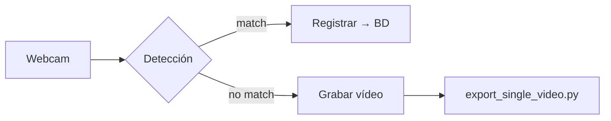

# 1. Título del Proyecto
**Face Recognition Attendance System (Local & Cloud)**

# 2. Descripción del Proyecto
- **Objetivo**  
  Automatizar el control de asistencia mediante reconocimiento facial en tiempo real.

- **Contexto y motivación**  
  El registro manual genera cuellos de botella, errores humanos y requiere supervisión.  
  En el laboratorio de IA se necesitaba acelerar el acceso y mantener un historial fiable.

- **Qué problema o necesidad resuelve y cómo lo hace**  
  Detecta rostros conocidos, registra hora de entrada/salida en **PostgreSQL** (modo local) o **Firebase** (modo nube) y confirma la operación por TTS.  
  Si el rostro es desconocido, graba un vídeo, lo almacena (en la base de datos local PostgreSQL o en el bucket en la nube de firebase) y envía reportes semanales por correo.

# 3. Demostración Visual
<!-- Inserta capturas, GIFs o video propio; si no hay, enlaza demos del estado del arte -->
<!--  -->
<p align="left">
  <a href="https://youtu.be/3TUlJrRJUeM">
    
  </a>
</p>

# 4. Requisitos Técnicos
| Componente | Versión recomendada | Notas |
|------------|--------------------|-------|
| **Python** | ≥ 3.10             | 64 bits |
| **OpenCV** | 4.9+               |   |
| **CMake** | 4.0.0+               |   |
| **face_recognition** | 1.3+      | Compila con dlib; requiere CMake ≥ 3.29 |
| **psycopg2** | 2.9+             | Solo modo local |
| **Firebase Admin SDK** | 6.x     | Solo modo nube |
| **pyttsx3** | 2.90              | TTS |
| **SO** | Windows 10/11 x64      | Probado |
| **Hardware** | Webcam HD ≥ 720p, CPU i5/Ryzen 5, 8 GB RAM |   |

Dependencias completas en **[requirements.txt](./requirements.txt)**.

# 5. Instalación y Configuración
```bash
# 1. Clonar el repositorio
git clone https://github.com/<usuario>/face-attendance.git 
cd face-attendance

# 2. (Opcional e Ideal) Crear entorno virtual
python -m venv face_recognition && venv\Scripts\activate

# 3. Instalar CMAKE
https://cmake.org/download/

# 4. Instalar dependencias
pip install -r requirements.txt

# 5 Firebase (Opcional)
Crear Firebase Storage, Firebase Bucket y establecer conexion a traves de variables de entorno

```

# 6. Estructura de Archivos del Proyecto
```text
├── dataset/                          # Imágenes organizadas por persona
├── exported_unknown_videos/         # Vídeos de rostros desconocidos
├── licenses/                        # Licencias del código base
├── requirements.txt                 # Dependencias Windows
├── requirements-mac.txt             # Dependencias macOS (experimental)
├── .gitignore                       # Excluye dataset y variables del .env
├── env_test.py                      # Verifica que variables de entorno sean detectadas
├── image_capture.py                 # Captura imágenes para el dataset de manera eficiente
├── model_training.py                # Entrena el modelo de reconocimiento facial y genera el archivo encodings.pickle
├── facial_recognition.py            # Detección facial básica, sin ninguna acción adicional
├── export_single_video.py           # Convierte videos de la base de datos de formato BLOB → MP4 y los guarda en la carpeta exported_unknown_videos
├── automatically_send_weekly_reports.py  # Envia 2 reportes a los correos respectivos, uno del registro semanal y otro del registro total vía SMTP
├── know_voices.py                   # Lista las voces de Windows disponibles para el uso del TTS
├── service_registration_local.py    # Servicio completo + PostgreSQL
├── service_registration_firebase.py # Servicio completo + Firebase
└── README.md                        # Documentación del Proyecto
```

# 7. Instrucciones de Ejecución
```bash
# A. Añadir un nuevo usuario al dataset (se debe modificar el nombre previamente en la variable respectiva)
python image_capture.py

# B. Entrenar o re-entrenar el modelo
python model_training.py

# C. Ejecutar en LOCAL (PostgreSQL)
python service_registration_local.py

# D. Ejecutar en NUBE (Firebase)
python service_registration_firebase.py
```
*Los argumentos opcionales están documentados al inicio de cada script.*

### 8. Explicación Técnica del Funcionamiento

1. **Preparación (`model_training.py`)**  
   - Recorre cada subcarpeta de **`dataset/`** y, usando una función interna llamada `face_recognition()`, genera un vector de **128 dimensiones** por rostro.  
   - Crea el archivo **`encodings.pickle`** con dos listas paralelas: `encodings` y `names`.

2. **Inicialización del servicio (`service_registration_local.py` / `service_registration_firebase.py`)**  
   - Carga los encodings, configura el motor TTS y agenda el envío semanal de reportes con **APScheduler**.  
   - Abre la webcam, fija la **escala de frame**, la **temperatura del modelo**, el **modelo de detección** y los *cooldowns* de asistencia para usuarios conocidos y desconocidos.

3. **Detección y comparación en vivo**  
   - Cada frame se redimensiona, se convierte a RGB y se detectan las ubicaciones de los rostros.  
   - Para cada rostro se calcula su embedding y se compara con todos los encodings mediante la **distancia Euclídea**; un voto mayoritario sobre los últimos `VOTE_LEN` frames reduce falsos positivos.

4. **Registro y feedback**  
   - **Rostro reconocido**  
     - Determina si corresponde **IN** o **OUT** según el último registro para diferenciar el ingreso o salida y el *cooldown* de 3 min.  
     - Inserta el registro en **PostgreSQL** o **Firebase** y reproduce la confirmación por voz.  
   - **Rostro desconocido**  
     - Graba ~5 s con `cv2.VideoWriter`, guarda el vídeo como BLOB (o en Cloud Storage) y ejecuta **`export_single_video.py`** para dejar una copia MP4 en la carpeta `exported_unknown_videos/`.

5. **Reportes automáticos (`automatically_send_weekly_reports.py`)**  
   - Todos los domingos a las 11 a.m. (hora de Lima) consulta la tabla **`attendance`** de la base de datos, genera dos CSV (semanal y global) y los envía por **SMTP** a la lista de destinatarios.
   - Borra los archivos temporales tras el envío para conservar espacio.



**Resumen:** el sistema sigue el pipeline *captura → detección → clasificación → acción*.  
En tiempo real decide si el rostro pertenece a un usuario conocido o desconocido, registra la asistencia o almacena evidencias, y luego envía reportes semanales sin intervención humana. Esto garantiza un control de acceso rápido, auditado y con trazabilidad tanto local como en la nube.


# 10. Buenas Prácticas y Errores Comunes
- Capturar ≥ 6 imágenes por persona, con variaciones de luz y ángulo.  
- Re-entrenar el modelo tras agregar usuarios.  
- Verificar permisos de escritura en `exported_unknown_videos/`.  
- En PostgreSQL, fijar la zona horaria:  
  ```sql
  SET TIME ZONE 'UTC';
  ```
- Si la cámara no inicia, asegúrate de que ninguna otra aplicación la esté usando.

# 11. Limitaciones del Proyecto
- Solo probado en Windows; compilación macOS/Linux no garantizada.  
- Sensible a cambios bruscos de iluminación.  
- No soporta múltiples cámaras en paralelo.

# 12. Recomendaciones Futuras
- Modificar el codigo para usarlo en una Raspberry Pi
- Contenedor Docker multiplataforma.  
- Dashboard web con métricas en tiempo real.  

# 13. Autores y Contacto
- **Juler Anderson Hermitaño Castro** — jahermit@ulima.edu.pe
- **Ignacio de Jesús Medina Urrunaga** — imedinau@ulima.edu.pe
